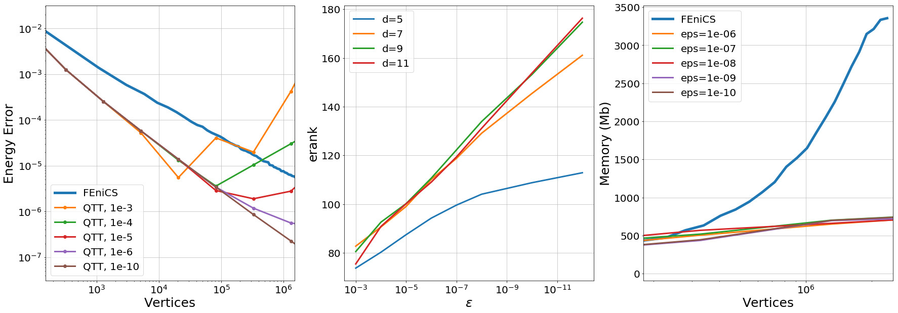

qtt-laplace
===========
A library for solving an elliptic differential equation in 2D using Finite Element Method (FEM) and Quantized Tensor Train (QTT) decomposition.

This library uses a special operation Z-kron to avoid approximation ranks growing in the QTT-format. 
This operation enables to build a matrix in the QTT-format with special rows and columns ordering -- z-order. 
As a result, this approach has slow approximation ranks growing and consumes much less memory than FEniCS. 



The left plot -- energy error from vertices number. 
The middle plot -- erank growing from approximation accuracy. 
The right plot -- a peak memory consumption from vertices number.

Related publications
=====================
Coming soon

Installation
============
Clone the repository:

```
   git clone git://github.com/RerRayne/qtt-laplace.git
```

Run setup.py from cloned dir:

```
   python setup.py install
```

Examples
==========================

Jupyter notebooks are available right now under [examples](examples/) directory.

For any questions, please create an issue on Github.

Authors
=======

This package are made by [Markeeva L.](https://github.com/RerRayne) and [Tsybulin I.](https://github.com/uranix).
